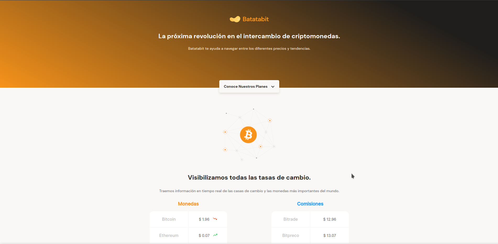

## Proyecto del curso mobile first de Platzi

Diseño web con HTML y CSS, iniciando desde pantallas mobiles a desktop, diseño mobile first y responsivo

[Visita la web](https://jcbcsystems.github.io/curso_mobile_first).

